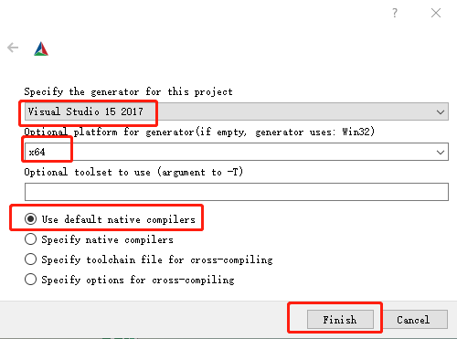

编译 C++项目PaddleOCR,需要下载paddlepaddle预测库[windows下C++预测库下载地址](https://paddleinference.paddlepaddle.org.cn/user_guides/download_lib.html#windows)，以及下载opencv库，本项目以[opencv4.1.1](https://opencv.org/opencv-4-1-1)为例.
下载paddle_inference，假设解压在D:\Paddle\paddle_inference目录下，文件夹结构如下：
```
paddle_inference                //文件夹
|--paddle          //paddle_inference库和.h文件
|--third_party        //第三方库和.h文件
|--CMakeCache.txt        
|--version.txt        
```

下载opencv，假设解压在D:\Paddle\opencv4.1.1\opencv目录下，文件夹结构如下：
```
opencv                //文件夹
|--build          //opencv构建的文件夹
|--sources        //opencv源码文件夹
|--LICENSE.txt        
|--LICENSE_FFMPEG.txt 
|--README.md.txt     
```
准备好Cmake工具，假设本项目代码下载到D:/PaddleOCRSharp目录，打开cmake-gui工具，源代码路径指向：D:/PaddleOCRSharp/PaddleOCR,
在D:/PaddleOCRSharp/PaddleOCR目录下创建一个bin文件夹，并在cmake-gui工具的构建输出目录指向D:/PaddleOCRSharp/PaddleOCR/Bin目录，
点击【Configure】,选择【Visual Studio 15 2017】(请提前安装vs2017),平台选择【x64】,如图，最后点击【Finish】.


【OPENCV_DIR】注意全大写的，值设置为：D:\Paddle\opencv4.1.1\opencv，
【PADDLE_LIB】值设置为：D:\Paddle\paddle_inference，
再次点击【Configure】，下方显示【Configuring done】说明配置成功，点击【Generate】,下方显示【Generating done】说明配置成功.点击【open Project】,用vs打开项目，并切换成【Release】，生成PaddleOCR项目即可。
